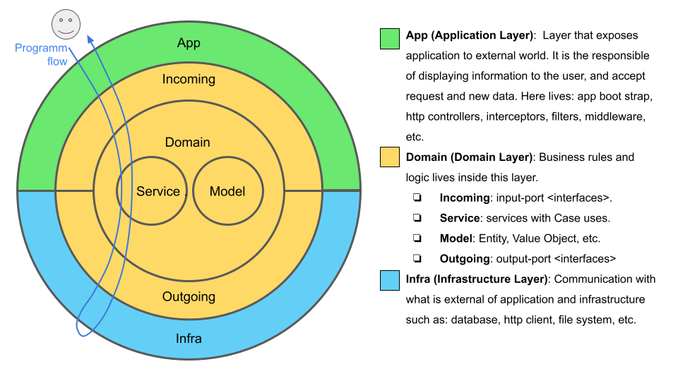

## Architecture

Main concepts for this architecture Hexa3L are around codebase scalability using Arquitectura hexagonal and DDD. The goal is to provide a clean architecture while flexible for implementing and growing functionalities into the codebase.



## Folder structure

```bash
.
└── src
    ├── app # Layer that exposes application to external world and users, and configure and launch the application module(s)
    │     ├── middleware # called before the route handler or controllers
    │     ├── filter
    │     ├── guard # Authorizator that determine whether a given request will be handled by the route handler or not
    │     ├── dto # Data Transfer Objects 
    │     └── controller # API Controllers responsible for handling incoming requests and returning responses to the client (routing)
    ├── domain # Layer for the domain to Business Logic
    │     ├── incoming # input-port, services interfaces 
    │     ├── service # Layer that composes application use cases 
    │     ├── model # Business domain classes and everything that composes domain model (Entities and Value Objects)
    │     └── outgoing # output-port to infrastructure interfaces
    │
    └── infra # Layer for communication with what is external of application and infrastructure
        ├── database # output-port to infrastructure interfaces
        │     ├── repository # implementation of repository pattern
        │     └── schema # Model schema for database
        └── etc 

```

## Code Rules

- The Ports and Adapters Pattern: 
a) From the app layer, only the domain layer is accessed through input-port (incoming).
b) From the domain layer, only the infra layer is accessed through output-port (outgoing).
- Dependency injection:
a) The incoming and outgoing implementations are injected via annotations or another mechanism.
- Domain core: 
a) From the domain it is not allowed to use infrastructure or application elements directly.

## Stack

- Stack: MERN + Nest + Typescript
- Programming Language: Javascript, Typescript
- Testing: Jest
- Build, pack & automation tool: npm
- Data Base NoSQL: Mongo
- Security, authentication & authorization: OAuth 2.0
- Backend Frameworks & libraries: NodeJS, NestJS
- Documentation: Swagger
- HTTP Client: Axios

## Errors Management Strategy

The error strategy used is to have the individual services in the domain throw a new subclass of DomainError(), and have the controller catch them and then, via an error handler or an interceptor, throw the appropriate type of HttpException (BadRequestException, ForbiddenException, etc. ). Having Http related stuff in domain layer (services) just seems wrong. For this reason, the domain layer does not handle http exceptions and will only attach an error code included in Domain Error to help the app layer determine which http exception corresponds.

The app layer (controllers, middleware, etc.) will throw exceptions in the response with the following JSON format:
```bash
{
    "statusCode": 400,
    "timestamp": "2022-11-03T20:38:09.613Z",
    "path": "/api/webshop/v1/profiles/all",
    "payload": {
        "code": 400,
        "detail": "Not authorized by the Auth Guard Middleware because no authorization data in Header.",
        "data": {
            "method": "GET",
            "url": "/api/webshop/v1/profiles/all"
        },
        "name": "HeadersAuthorizationError"
    },
    "message": "The headers Authorization in HTTP Request has a format error."
}
```

The name indicates the specific type of custom exception.

## Installation from zero

Install Visual Studio Code

Install extension: ES7+ React/Redux/React-Native snippets

Install Node.js version LTS 

```bash
node -v
v16.16.0
npm -v
npm WARN config global `--global`, `--local` are deprecated. Use `--location=global` instead.
8.11.0
npx -v
npm WARN config global `--global`, `--local` are deprecated. Use `--location=global` instead.
8.11.0
```

Install Git from https://git-scm.com/
```bash
git --version
git version 2.37.1.windows.1
```
Clone repo, by example:

```bash
git clone https://github.com/dariopalminio/daro-web-app.git
```

Install MongoDB in local machine Version 5.0.10-rc0 from https://www.mongodb.com/try/download/community

Configure MongoDB PATH

- Server: C:\Program Files\MongoDB\Server\6.0\bin\mongod
- Client: C:\Program Files\MongoDB\Server\6.0\bin\mongo
- Data: C:\Program Files\MongoDB\Server\6.0\data\

Start Data Base Server 

export PATH=/Users/dariopalminio/Applications/mongodb-macos-x86_64-4.4.6/bin:$PATH
mongod --dbpath /Users/dariopalminio/data/db

Install Keycloak 13.0.1 from https://www.keycloak.org/archive/downloads-13.0.1.html

Because Keycloak uses Java, then install JDK from https://jdk.java.net/

Configure environment var JAVA_HOME and PATH
```bash
javac -version
javac 17
```

Configure Keycloak PATH and execute 
```bash
standalone.bat
```

Start Keycloak Server in http://127.0.0.1:8080/auth/ 

Server running and go to http://localhost:8080/auth/ 

Create admin user with admin pass in Keykloak

Login as admin

Create Realm  with name: my-realm-test

Create Client with name:	rest-client-test

Copy client ID (example: d1dd32a1-1e54-4f8f-96d3-18c7a8466408)

Configure .env with Keycloak variables

Install NestJS as global

```bash
sudo npm i -g @nestjs/cli
nest new daro-web-shop-backend
npm install dotenv
npm install nodemailer
npm i --save-dev @types/nodemailer
npm i @types/nodemailer-smtp-transport --save
```

## Installation

```bash
$ npm install
```

## Run

Start Mongo Data Base Server 

export PATH=/Users/dariopalminio/Applications/mongodb-macos-x86_64-4.4.6/bin:$PATH
mongod --dbpath /Users/dariopalminio/data/db

Start Keycloak Server 

cd Applications/keycloak-13.0.1/bin
sh standalone.sh
http://127.0.0.1:8080/auth/
admin admin

Start cliente http://localhost:3000/


```bash
# development
$ npm run start

# watch mode
$ npm run start:dev

# production mode
$ npm run start:prod
```

## Test

```bash
# unit tests
$ npm run test

# e2e tests
$ npm run test:e2e

# test coverage
$ npm run test:cov
```

## Support

Nest is an MIT-licensed open source project. It can grow thanks to the sponsors and support by the amazing backers. If you'd like to join them, please [read more here](https://docs.nestjs.com/support).

## Stay in touch

- Author - [Kamil Myśliwiec](https://kamilmysliwiec.com)
- Website - [https://nestjs.com](https://nestjs.com/)
- Twitter - [@nestframework](https://twitter.com/nestframework)

## License

Nest is [MIT licensed](LICENSE).

## References

- Code commits standard: https://www.conventionalcommits.org/en/v1.0.0/
- Node Style Guide: https://github.com/felixge/node-style-guide
- Naming cheatsheet NestJS: https://narhakobyan.github.io/awesome-nest-boilerplate/docs/naming-cheatsheet.html#should
- API Guide: https://github.com/byrondover/api-guidelines/blob/master/Guidelines.md#errors
- DDD article: https://bazaglia.com/clean-architecture-with-typescript-ddd-onion/
- DDD Code example: https://github.com/bazaglia/shopping-cart
- The Clean Architecture: https://blog.cleancoder.com/uncle-bob/2012/08/13/the-clean-architecture.html
- https://nestjs-i18n.com/


